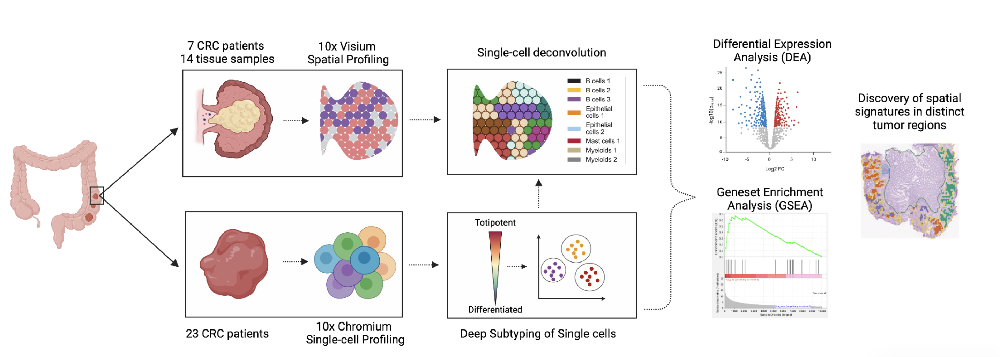

# BMI 212 Course Project Repository

This repository contains scripts for the project "Characterizing colorectal cancer subtypes at spatially-informed single-cell resolution"for BMI 212 course at Stanford University.
The workflow includes exploratory data analysis, preprocessing, deep subtyping of single-cells based on their absolute developmental potential, single-cell deconvolution of spatial spots, analysis of spatially variable genes and enriched genesets, and identification of spatial signatures in distinct tumor regions. The corresponding scripts of all the steps can be found in this repository.

### Scripts Description

- **`calculate_deconvolution_evaluation_metrics.py`**  
  *Calculates evaluation metrics for deconvolution analysis.*  
  **Author: Priyanka Shrestha**

- **`create_sce.R`**  
  *Script to create a Single Cell Experiment (SCE) object from scRNA-seq data and perform EDA.*  
  **Author: Jake Chang**

- **`cside.R`**  
  *Implements the C-SIDE method for cellular subtype identification.*  
  **Author: Jake Chang**

- **`ct2_on_scRNA.R`**  
  *Runs the CytoTRACE 2 tool on single-cell RNA-seq data to assess cellular developmental potency.*  
  **Author: Susie Avagyan**

- **`ct2_phenotype_clustering.R`**  
  *Performs clustering based on phenotypes derived from CytoTRACE 2 and visualizes results using UMAP.*  
  **Author: Rohit Khurana**

- **`de_scrnaseq.R`**  
  *Analyzes differential expression in single-cell RNA-seq data.*  
  **Author: Jake Chang**

- **`gene_pathways.py`**  
  *Conducts gene pathway enrichment analysis.*  
  **Author: Priyanka Shrestha**

- **`plot_umap.R`**  
  *Visualizes scRNA-seq data using UMAP plots of initial and refined subtypes.*  
  **Author: Susie Avagyan**

- **`run_cytospace.sh`**  
  *Bash script to prepare input data and run the Cytospace tool.*  
  **Author: Susie Avagyan**

- **`run_cytospace_prep.sh`**  
  *Bash script for preparing input data specifically for running Cytospace.*  
  **Author: Susie Avagyan**

- **`scRNAseq_qa.R`**  
  *Performs quality control checks on single-cell RNA-seq data.*  
  **Author: Jake Chang**

- **`spatial_de_vis.R`**  
  *Visualizes differential expression in a spatial context.*  
  **Author: Jake Chang**
